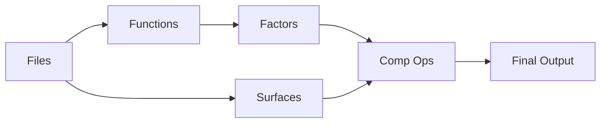

# Thematic Rendering Usage

## Overview

Thematic Rendering is a GIS-based rendering system for turning georeferenced raster inputs into a polished map surface.

Instead of styling one raster at a time, the system combines multiple GIS layers—such as elevation, slope, precipitation, forest cover, lithology, water proximity, and categorical land-cover rasters—into a staged rendering workflow. This makes it possible to build outputs that look more like a finished terrain or landscape rendering than a standard raster style.

Typical uses include:

- blending dry and humid terrain styles
- displaying categories from products such as USGS Landfire
- softening hard raster boundaries into more natural transitions
- applying hillshade, texture, and zonal effects
- previewing and tuning a render design quickly

## High-level workflow

At a high level, a render works like this:

1. **Files** define the input georeferenced rasters and supporting resources.
2. **Functions** turn those source rasters into reusable **factors**.
3. **Surfaces** define color layers or material layers that can be drawn into the render.
4. The **pipeline** defines an ordered sequence of **compositing operations** that combine surfaces and factors into the final output.




## Core rendering components

### Files

**Files** are the source datasets and supporting resources used by the render.

These usually include georeferenced raster inputs such as:

* DEM
* slope
* precipitation
* forest or canopy
* lithology
* water proximity
* categorical theme rasters

They can also include supporting resources such as color ramps or QML theme definitions.

Files are the raw ingredients the render starts with.

---

### Surface

A **surface** is a render-ready visual layer.

A surface usually starts from one source raster and converts it into a color or material layer that can be blended into the render. It may also include modifiers such as mottling or texture.

A surface is not the source raster itself. It is the visual layer generated from that raster.

Examples:

* arid soil surface
* humid vegetation surface
* snow surface
* thematic overlay surface

---

### Factor

**Factors**  control where and how strongly a surface should appear. A factor is often a grayscale-like signal in the range `0–1`, although some factors may carry raw physical values such as elevation in meters.

Typical factor roles include:

* blend mask
* opacity control
* transition zone
* distance gradient
* terrain constraint

Examples:

* moisture
* forest density
* snow mask
* elevation

A factor does not usually provide color by itself. Instead, it controls blending, masking, opacity, or other render decisions.

---

### Function

A **function** is the logic used to create a factor.

Functions take source rasters and supporting data and turn them into usable render signals. For example, a function may:

* pass through an unmodified raster
* convert a continuous raster into a `0–1` mask
* create a categorical mask from a theme raster
* create a natural-looking snowline
* evaluate a custom mathematical expression

---

### Comp op

A **comp op** (compositing operation) is a render step that combines layers.

Comp ops define what to do with surfaces, factors, and buffers, such as:

* create a new buffer
* blend one surface into another
* merge two buffers
* multiply by a shading layer
* alpha-composite a thematic overlay
* write the final output

---

### Pipeline

The **pipeline** is the ordered list of rendering steps and their parameters.

This is the part of the config that says, step by step, how to build the final image. Each pipeline item usually references:

* a **comp op**
* one or more **surfaces**
* a controlling **factor**
* sometimes a target **buffer**

Because the pipeline is ordered, each step builds on the previous ones. 

---
## Additional rendering components

### Theme

A **theme** is a categorical raster in which each class is represented by a distinct pixel value.

For example, a theme raster might encode:

* glacier = 1
* volcanic = 2
* playa = 3

Any pixel with value `2` would be interpreted as volcanic.

Themes are mainly used for category-based masking and overlays.

---

### Buffer

A **buffer** is an intermediate working image used during rendering.

Buffers store the results of compositing steps so they can be reused later in the pipeline. The default buffer is usually named `canvas`. Additional buffers can be created for more complex renders and later merged back into the main canvas.

Buffers are the main working render targets inside the pipeline.

---

### Noise

The engine includes a configurable **noise library** for generating organic variation and texture.

Noise can be used to:

* soften hard raster boundaries
* add natural-looking mottling
* create stretched directional textures
* vary snowlines, vegetation edges, or terrain transitions
* introduce surface texture without changing the source GIS data

Noise profiles are typically built from multiple spatial scales, so they can combine fine detail with broad organic structure.

# DETAILS

## Factors

**Factors** convert source rasters and supporting data into reusable **render signals**.

A **factor** is usually a 2D numeric layer used to control color blending, masking, opacity, shading, texture, or 
category-based effects. A factor is not usually the final image by itself. Instead, it acts like a control surface that tells the rendering 
pipeline **where** and **how strongly** to apply an effect.

Some factors preserve raw values exactly, while others convert a raster into a normalized 0–1 mask, a distance-based gradient, 
a thematic class mask, or a more natural-looking terrain boundary.

## Factor functions at a glance

| Function ID           | Purpose                                                                          | Typical GIS use                                                                    |
|-----------------------|----------------------------------------------------------------------------------|------------------------------------------------------------------------------------|
| `raw_driver`          | Passes a source raster through unchanged                                         | Raw elevation in meters, raw slope, raw theme IDs.                                 |
| `mapped_signal`       | Converts a continuous raster into a smooth 0–1 influence mask.                   | Moisture gradients, vegetation density, lithology influence, normalized elevation. |
| `theme_composite`     | Combines multiple thematic classes into one composite alpha mask.                | Water + rock + glacier overlays from a category raster.                            |
| `protected_shaping`   | Converts a grayscale raster into a safer brightness-modulation                   | Hillshade or texture modulation without crushing map colors.                       |
|                       | factor that protects shadows and highlights.                                     |                                                                                    |
| `specular_highlights` | Creates small bright glints from noise, optionally limited by a mask.            | Sparkle on water, glacier, or wet surfaces.                                        |
| `noise_overlay`       | Creates a texture-like multiply factor from a noise profile.                     | Surface mottling, mineral texture, canopy variation, water variation.              |
| `proximity_power`     | Converts a proximity or distance raster into a smooth distance-based gradient.   | Bathymetric darkening, shoreline fades, interior distance effects.                 |
| `categorical_mask`    | Creates a binary mask for one named category in a thematic raster.               | Water mask, glacier mask, volcanic mask, playa mask.                               |
| `edge_fade`           | Creates a soft transition within a named category using proximity.               | Shoreline fade, tree-line thinning, marsh or playa margins.                        |
| `constrained_signal`  | Builds a natural-looking boundary using a primary signal,                        | Snowlines, tree-lines, alpine bands, terrain-limited vegetation zones.             |
|                       | optional noise jitter, and a physical constraint.                                |                                                                                    |
| `expression`          | Evaluates a validated custom math expression using declared drivers and factors. | Custom raster logic, one-off masks, terrain rules, prototype factors.              |


## raw_driver
Prepares a source raster without change for pipeline use.  Note, you cannot directly use a source raster without going through at
at least one factor.

## mapped_signal

Converts a source raster into a usable **0–1 influence mask** for blending, masking, or surface transitions.

This is the general-purpose factor for turning continuous GIS layers into render-ready signals. Typical uses include:

- turning precipitation into an **arid-to-humid blend mask**
- turning forest density into a **vegetation coverage mask**
- turning lithology into a **rock color influence mask**
- turning elevation into a **normalized terrain gradient**

In most cases, this is the factor to use when you want a raster to act like a smooth control layer rather than as raw values.

### Examples

- Use a precipitation raster to control where the render shifts from dry terrain to lush terrain.
- Use a forest or canopy raster to control where vegetation colors should appear.
- Use a lithology raster to softly introduce red rock, volcanic, or mineral surface treatments.

### Sample

```yaml
factors:
  precip:
    function_id: mapped_signal
    drivers: [precip]
    required_noise: biome
    params:
      start: 200
      full: 500
      noise_amp: 0.3
      contrast: 2.5
    desc: Moisture gradient for biome blending.
```

### When to use it

Use `mapped_signal` when you want a raster to become a **soft blend mask** or **continuous influence surface**.

Use `raw_driver` instead when you need the original values unchanged.


## theme_composite

Builds one combined **alpha mask** from one or more thematic categories in a categorical raster.

This is used when you have a theme or classification raster and want selected classes—such as water, rock, glacier, volcanic, or playa—to contribute to a single overlay mask. The function evaluates the 
active category settings and merges them into one composite transparency layer. 

### What it is good for

Use `theme_composite` when you want to overlay one or more thematic classes on top of the main terrain rendering with smooth or organic edges.

Typical uses include:

- drawing water, rock, and glacier classes over a base terrain
- softening the edges of class boundaries so they do not look pixelated
- applying one combined overlay even when several categories are active

### Examples

- Combine water, glacier, and bare rock classes from a themed land-cover raster into one overlay mask.
- Build a single transparency layer for several special categories rather than managing each one separately in the pipeline.

### Sample

```yaml
factors:
  theme_overlay_alpha:
    function_id: theme_composite
    drivers: [theme]
    params:
      water:
        enabled: true
        blur_px: 5.0
        max_opacity: 0.6
      rock:
        enabled: true
        blur_px: 5.0
        max_opacity: 1.0
      glacier:
        enabled: true
        blur_px: 0.0
        max_opacity: 1.0
```

### When to use it

Use `theme_composite` when you want a **smoothed, combined overlay mask** from a thematic raster.

Use `categorical_mask` when you only need **one named class** as a simple binary mask.


## protected_shaping

Turns a grayscale raster into a **safe multiply factor** for shading or texturing, while protecting the darkest shadows and brightest highlights.

This is useful when you want to apply hillshade or another tonal layer without crushing the image into pure black or washing it out into pure white. 
In map terms, it lets you add relief and texture while preserving readable color. 

### What it is good for

Use `protected_shaping` when you want to convert a grayscale input into a controlled light/dark modulation layer.

Typical uses include:

- making hillshade affect the terrain more gently
- adding texture or tonal variation without destroying the underlying colors
- preserving detail in deep shadow and bright highlight areas

### Examples

- Use a hillshade raster to give terrain more depth without making valleys too dark.
- Use a texture raster to add relief while keeping snow, bright rock, or water from being over-darkened.

### Sample

```yaml
factors:
  hillshade_safe:
    function_id: protected_shaping
    drivers: [hillshade]
    params:
      input_scale: 255.0
      gamma: 1.25
      low_start: 0.0
      low_end: 0.2
      protect_lows: 0.02
      high_start: 0.85
      high_end: 1.0
      protect_highs: 0.02
      strength: 0.85
```

### When to use it

Use `protected_shaping` when a raster will be used as a **brightness modifier** and you want a more cartographic result than a raw multiply.


## specular_highlights

Creates bright glints or sparkle highlights from a noise pattern, optionally limited by a mask.

This is useful for adding small bright highlights to surfaces such as water, wet areas, ice, or reflective terrain. 
The effect is controlled by a noise profile and shaping parameters. 

### What it is good for

Use `specular_highlights` when you want localized sparkle rather than broad shading.

Typical uses include:

- sun glints on water
- ice sparkle on snow or glacier surfaces
- wet-looking highlights on dark surfaces

### Examples

- Add point-like highlights only inside lake polygons.
- Add subtle glints to glacier areas or wet playa surfaces.

### Sample

```yaml
factors:
  water_glints:
    function_id: specular_highlights
    required_noise: water
    required_factors: [water_mask]
    params:
      scale: 6.0
      floor: 0.4
      sensitivity: 2.0
```

### When to use it

Use `specular_highlights` when you want **small bright reflections**.

Use `noise_overlay` when you want **broad texture modulation** instead.


## noise_overlay

Creates a multiply-ready texture factor from a named noise profile, optionally limited by a mask.

This function produces controlled fine or medium-scale variation that can be used to break up flat areas, add mottling, or create a more natural-looking surface. The result is centered 
around **1.0**, which makes it suitable for multiply-style compositing. 

### What it is good for

Use `noise_overlay` when you want a surface to feel less flat and more organic.

Typical uses include:

- subtle color or brightness variation in water
- granular mineral texture on rock
- surface mottling in vegetation, desert soils, or snow

### Examples

- Add broad, stretched texture to lakes or coastal water.
- Add fine mineral variation to a rock overlay.
- Add canopy-style texture to vegetation masks.

### Sample

```yaml
factors:
  rock_texture:
    function_id: noise_overlay
    required_noise: fine_mottle
    required_factors: [rock_mask]
    params:
      scale: 3.0
      intensity: 0.2
```

### When to use it

Use `noise_overlay` when you want **textural breakup** based on a noise profile.

Use `specular_highlights` when you want **isolated bright points** instead of overall texture.

## proximity_power

Converts a proximity raster into a **distance-based gradient**, optionally limited by a mask.

This is useful when you already have a distance or proximity raster and want to convert it into a smooth fade from the edge or from the center of a feature. The 
result can be used for darkening, tinting, soft transitions, or zonal effects. 

### What it is good for

Use `proximity_power` when you want to create a gradient based on distance.

Typical uses include:

- bathymetric-style darkening in lakes
- shoreline transitions
- edge softening near certain features
- gradual interior effects inside a category

### Examples

- Darken water away from the shoreline using a water proximity raster.
- Build a smooth interior fade inside a wetland, playa, or glacier.

### Sample

```yaml
factors:
  water_depth:
    function_id: proximity_power
    drivers: [water_proximity]
    required_factors: [water_mask]
    params:
      max_range_px: 300.0
      sensitivity: 2.5
```

### When to use it

Use `proximity_power` when your source raster already stores **distance from a feature** and you want to turn that into a smooth 0–1 gradient.


## categorical_mask

Creates a simple **binary mask** for one named category in a thematic raster.

If the target class is present, pixels in that class become `1.0`; all other pixels become `0.0`. This is 
the most direct way to isolate one category from a classification or theme raster. 

### What it is good for

Use `categorical_mask` when you want one named class as a clean yes/no mask.

Typical uses include:

- isolating water
- isolating glacier
- isolating rock
- isolating any named category from the theme registry

### Examples

- Create a water mask from a land-cover theme.
- Select only glacier pixels from a classified raster.
- Build a mask for volcanic, playa, or urban classes.

### Sample

```yaml
factors:
  water_mask:
    function_id: categorical_mask
    drivers: [theme]
    params:
      label: water
```

### When to use it

Use `categorical_mask` when you need **one category only**.

Use `theme_composite` when you want **multiple thematic classes blended together**.


## edge_fade

Creates a smooth transition inside a named category using a proximity raster.

This is useful when you want a feature to fade gradually rather than having a hard binary edge. It is commonly used for shorelines, tree-lines, wetland edges, 
or any place where a categorical boundary should taper inward. 

### What it is good for

Use `edge_fade` when you want a named class to be strongest near one part of the feature and weaker near its edge or interior, depending on how the proximity raster was built.

Typical uses include:

- fading water toward the shore
- thinning vegetation at the tree-line
- creating a soft margin on thematic features

### Examples

- Create a smooth water alpha near shorelines.
- Thin a forest class near its edge instead of drawing a hard boundary.
- Build a gradual margin for playa, marsh, or glacier classes.

### Sample

```yaml
factors:
  shoreline_fade:
    function_id: edge_fade
    drivers: [water_proximity]
    params:
      label: water
      ramp_width: 15.0
      sensitivity: 1.0
```

### When to use it

Use `edge_fade` when you want a **soft category edge** instead of a hard on/off mask.

### Note

This function assumes you already have a suitable proximity raster for the feature you want to fade.

## constrained_signal

Creates a natural-looking transition line or zone by combining:

- a primary geographic variable
- optional noise-based wandering
- a secondary physical constraint

This  is designed for boundaries that should not follow a perfectly smooth contour line. Instead, the boundary can wander 
naturally while still respecting terrain limits such as slope. 

### What it is good for

Use `constrained_signal` when you want a boundary that is:

- based on a measured variable such as elevation or distance
- softened into a transition zone
- made more natural with noise
- limited by a physical rule such as steepness

Typical uses include:

- snowlines
- tree-lines
- alpine vegetation limits
- moisture bands
- any terrain boundary that should wander naturally but still obey terrain conditions

### How it works

1. It starts with a **primary driver** such as elevation.
2. It optionally adds **noise-based jitter** so the line does not follow a perfect contour.
3. It converts that result into a smooth **0–1 transition zone**.
4. It applies a **constraint driver** such as slope to reduce or remove the signal where terrain conditions are unsuitable.

### Examples

- Snow appears above a certain elevation, but not on very steep cliffs.
- Tree-line wanders naturally upslope and downslope, but drops out on exposed rock faces.
- A moisture band follows a general elevation range but is constrained by another terrain variable.

### Sample

```yaml
factors:
  snow_mask:
    function_id: constrained_signal
    drivers: [dem, slope]
    params:
      threshold: 3200
      ramp: 120
      noise_id: drifts
      jitter_amt: 300
      constraint_limit: 35
      constraint_fade: 8
```

### When to use it

Use `constrained_signal` when a boundary should feel **geographically believable** rather than mechanically uniform.

Use `mapped_signal` when you only need a straightforward continuous mask without this extra terrain logic.

## expression

The `expression` factor allows you to write custom raster math directly in YAML using a restricted, validated math syntax. It is designed for advanced cases where you want a custom mask or influence surface without adding a new Python function. 

### What it is good for

Use `expression` when you want to combine existing drivers and factors with custom logic such as:

- elevation-and-slope masks
- moisture and canopy combinations
- custom thresholding
- one-off terrain rules for preview testing

### Basic syntax

Set `function_id` to `expression` and provide an expression string in `params.expr`.

```yaml
factors:
  alpine_mask:
    function_id: expression
    drivers: [dem]
    params:
      expr: "clamp((dem - 2500) / 500, 0, 1)"
```

### Variables

Expressions can use:

1. **Drivers** listed in `drivers: []`
2. **Factors** listed in `required_factors: []`

Any factor referenced here must be defined earlier in the YAML so it is available when the expression is evaluated.

```yaml
factors:
  moisture:
    function_id: mapped_signal
    drivers: [precip]

  lush_valley:
    function_id: expression
    drivers: [dem]
    required_factors: [moisture]
    params:
      expr: "moisture * (1.0 - clamp(dem / 1000, 0, 1))"
```

### Available functions

| Function                  | Description                               |
|---------------------------|-------------------------------------------|
| `clip(x, lo, hi)`         | Limit values to a range.                  |
| `min(a, b)` / `max(a, b)` | Cell-by-cell minimum or maximum.          |
| `pow(base, exp)`          | Power function.                           |
| `abs(x)`                  | Absolute value.                           |
| `sqrt(x)`                 | Square root.                              |
| `exp(x)` / `log(x)`       | Exponential and natural logarithm.        |
| `where(cond, a, b)`       | Conditional raster logic.                 |
| `lerp(a, b, t)`           | Linear interpolation.                     |
| `clamp(x, lo, hi)`        | Readable alias for `clip`.                |
| `smoothstep(e0, e1, x)`   | Smooth 0–1 transition between two values. |

### NoData and dimensional safety

* Inputs are automatically converted to clean **2D raster arrays**
* valid-data masks are combined automatically
* if a referenced input has NoData at a pixel, the expression output is masked there too
* if the expression returns a single number, it is expanded to fill the full tile

### Sample

```yaml
factors:
  complex_snow:
    function_id: expression
    drivers: [dem, slope]
    required_factors: [jitter]
    params:
      expr: "smoothstep(3000, 3200, dem + jitter) * (1.0 - smoothstep(35, 45, slope))"
```

### When to use it

Use `expression` when the built-in factors are close, but you need a **custom combination rule** for a specific render.

Use a dedicated built-in factor when the logic already exists, because built-in factors are usually easier to read and document.

## Composite Operations

### create_buffer

This starts the pipeline by placing a surface into a buffer.  Normally the pipeline uses the default buffer
named `canvas' although addtional buffers can be used for complex renderings.

In addition, rather than use a surface, you can create directly create a single colored surface and add it to the buffer.
```  - desc: Diagnostic Blackboard
    enabled: false
    comp_op: create_buffer
    buffer: canvas
    params:
      color: [0, 0, 0]  
 ```
### lerp_surfaces

Blends two **surfaces** together using a **factor** as the control mask.

Use this when you have two different visual treatments and want the render to transition smoothly between them. A factor value near `0` favors the first surface, and a value near `1` favors the second.

Typical uses include:

- blending arid and humid terrain styles
- transitioning between two rock or soil palettes
- mixing lowland and alpine surface treatments

---

### lerp_surface_to_buffer

Blends one **surface** into an existing **buffer** using a **factor** as the control mask.

Use this when you already have a working render in a buffer and want to add a new surface only where the factor allows it.

Typical uses include:

- adding vegetation to an existing terrain buffer
- applying snow to high elevations
- overlaying a special surface treatment in selected areas

---

### lerp_buffers

Blends one **buffer** into another using a **factor** as the control mask.

Use this when two different intermediate render results have already been built and need to be merged.

Typical uses include:

- merging a humid-region render into a dry-region base
- combining two separately prepared terrain variants
- mixing alternate render branches back into the main canvas

---

### multiply_op

Multiplies a **buffer** by a factor or modulation layer to darken, shade, or texture the image.

Use this when you want to apply hillshade, tonal variation, or other multiplicative effects. Multiplication usually makes the image darker unless the factor is near `1.0`.

Typical uses include:

- applying hillshade to terrain
- adding texture variation
- darkening selected regions based on a control factor

---

### alpha_over_op

Draws one visual layer over another using alpha compositing.

Use this when you want an overlay to sit on top of the existing image, while respecting transparency. This is commonly used for thematic overlays and special feature layers.

Typical uses include:

- drawing water, rock, or glacier overlays
- placing a thematic surface over the terrain base
- adding feature layers that should sit visually above the background

---

### add_specular_highlights

Adds bright highlight glints to the current render.

Use this when you want small reflective highlights rather than broad shading. This is most useful for surfaces that should catch light, such as water, wet ground, or ice.

Typical uses include:

- water sparkle
- wet-looking highlights
- glints on glacier or snow surfaces

---

### apply_zonal_gradient

Applies a color gradient inside a specific zone, usually controlled by a factor and limited by a mask.

Use this when you want the color inside a feature to vary from edge to center or by distance. This is useful for depth-style effects or subtle internal variation.

Typical uses include:

- bathymetric-style darkening in lakes
- shoreline-to-center water gradients
- zonal tinting inside wetlands, playas, or snowfields

## Surfaces

### Ramps

A **ramp surface** uses a continuous raster value—most often elevation—to sample a color ramp and create a render-ready visual layer.

Use ramp surfaces when the appearance should vary smoothly across a continuous geographic variable.

Typical uses include:

- elevation-based terrain coloring
- snow color by elevation
- dry-to-moist land color variation
- broad terrain base layers

### Theme

A **theme surface** uses a categorical theme raster and its class styling to create a visual overlay.

Use theme surfaces when the appearance depends on named classes rather than continuous values.

Typical uses include:

- land-cover or thematic category rendering such as USGS LANDFIRE